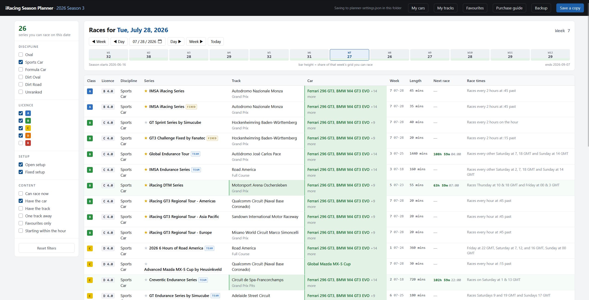

# iRacing Season Planner



A single-page, offline-first planner for iRacing's official season schedule. Point it at a season
and it shows, for any date, every series racing that week — cross-referenced against the cars and
tracks you actually own, so you can see at a glance what you can race *right now*.

No account, no install, no server required to just look at it — open `index.html` in a browser.
Run the included local server if you want your picks to autosave to disk.

## Features

- **Any date, any week** — step by day or week, jump to today, or click a week in the season
  ribbon (bar height = how much of that week's schedule you can currently race).
- **Ownership-aware** — tick the cars and tracks you own once; every row shows whether you can
  race it, need a track, need a car, or are "one track away."
- **Filters** — discipline, licence class, open vs. fixed setup, favourites only, races starting
  within the hour, and more.
- **Next race countdown** — parses the schedule's published race cadence (e.g. "every 2 hours",
  "Thur & Sat at 10, 19 GMT") and counts down to the next green light in your local time.
- **Purchase guide** — ranks the tracks you don't own by how many weeks of racing owning them
  would unlock, scoped to your favourite series or the whole schedule.
- **Series drill-down** — click any series to see its full week-by-week schedule, tracks, cars,
  and lengths.
- **Portable saves** — back up your picks as text, restore them on another machine, or download a
  self-contained copy of the page with your current picks baked in.

## Quick start

1. Get the current season schedule PDF from iRacing: **Racing → Season Schedule → download PDF.**
2. Convert it to JSON:
   ```
   pip install pdfplumber
   python season_to_json.py SeasonSchedule.pdf -o season.json
   ```
   (On Windows, always use `-o`, never `> season.json` — PowerShell redirection writes UTF-16,
   which the planner can't read.)
3. Run the local server from this folder:
   ```
   python serve.py
   ```
   This opens the planner at `http://127.0.0.1:8765/` and autosaves every change you make to
   `planner-settings.json` next to it.
4. Tick the cars and tracks you own (**My cars** / **My tracks**), star a few favourite series, and
   start browsing.

You can also skip `serve.py` entirely and just open `index.html` directly in a browser — the app
still works, it just can't autosave (use **Save a copy** to download your picks baked into a new
copy of the page instead).

## Moving to a new season

Every quarter, re-run `season_to_json.py` on the new schedule PDF, then in the planner open
**Backup → Load season…** and pick the new `season.json`. Your owned cars, tracks, and favourites
carry over automatically — they're matched by name, not position.

`season_to_json.py` also needs its `FREE_CARS` / `FREE_TRACKS` lists touched up once a season,
since iRacing's free/base content changes — the current list is published at
[iracing.com/membership](https://www.iracing.com/membership) (scroll to the bottom).

## Privacy

Nothing leaves your machine. `serve.py` binds only to `127.0.0.1` and only ever reads and writes
files in this one folder. There's no analytics, no external requests beyond loading
`season.json`/`planner-settings.json` from disk, and no account of any kind.

## How saving works

The planner tries, in order: the `planner-settings.json` file via `serve.py`, then your browser's local storage, and finally falls
back to manual save/restore through the **Backup** dialog or **Save a copy**. Whichever is active
is shown in the top bar.

## License

Public domain — see [LICENSE](LICENSE).
